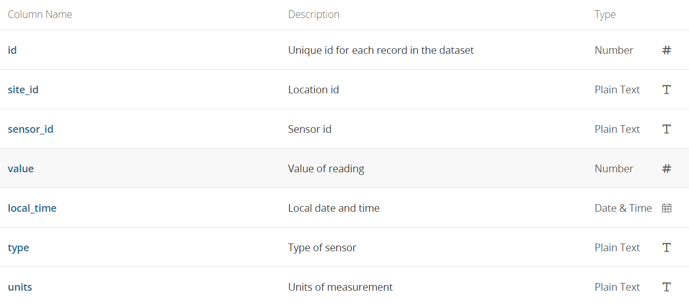

```{r setup, include=FALSE}
options(htmltools.dir.version = FALSE)

knitr::opts_chunk$set(warning = FALSE, message = FALSE, error = FALSE, tidy.opts = list(width.cutoff=60), tidy=TRUE)
```

```{r xaringan-themer, include=FALSE, warning=FALSE}
library(xaringanthemer)
style_duo_accent(
  primary_color = "#1381B0",
  secondary_color = "#FF961C",
  inverse_header_color = "#FFFFFF"
)

library(readr)
library(dplyr)
library(tidyverse)
library(lubridate)
library(fontawesome)
```


.center[

## CWD Group Presentation

`r Sys.Date()`  


  
Dea Avega Editya


  
M. Sobyan Qasim

]

---
.center[
### Research question:
]

.center[
Does Melbourne really has 4 (four) seasons in a day?  
]
--
.center[
What makes a season anyway?  
]
--
.center[
### Secret recipe to make a distinguish season
]
--
.center[
 
 

]
--
.center[

]
---

### Let's Try to Find Out! `r fa("search", fill = "lightred")`

#### Steps Revealed

To find the answer for our research question, we need to compare temperature in a regular day to 4 different typical temperature of each season.  
It should be also done for humidity!  

Therefore, we need to:  
--  
1. Explore data of temperature & humidity in the dataset
1. Count average number per hour for these variables
1. Compare the number to threshold
1. Plot the comparison

---

### Loading Dataset of Melbourne Sensor

```{r echo = TRUE}
melb_sensor <- read.csv("Microclimate_Sensor_Readings.csv")

melb_temp <- melb_sensor %>% 
  filter(units %in% c("C", "%")) %>%
  mutate(time = ymd_hms(local_time)) %>% 
  mutate(hour = lubridate::hour(time), date = date(time), month = month(time))

```

Data source: [melbourne.vic.gov.au](https://data.melbourne.vic.gov.au/Environment/Microclimate-Sensor-Readings/u4vh-84j8?src=featured_banner)

Data is updated hourly hence consist of 1.34 million rows!  
There are 7 variables inside.

.center[

]
---

### Finding Typical Temperature & Humidity for Each Season

```{r echo = FALSE, warning = FALSE}
# average in seasons
# summer
ave_summer <- melb_temp %>% 
  filter(units == "C", type == "TPH.TEMP-EPA-1h", month %in% c(12, 1, 2)) %>% 
  summarise(average = mean(value))

ave_spring <- melb_temp %>% 
  filter(units == "C", type == "TPH.TEMP-EPA-1h", month %in% c(9, 10, 11)) %>% 
  summarise(average = mean(value))

ave_autumn <- melb_temp %>% 
  filter(units == "C", type == "TPH.TEMP-EPA-1h", month %in% c(3, 4, 5)) %>% 
  summarise(average = mean(value))

ave_winter <- melb_temp %>% 
  filter(units == "C", type == "TPH.TEMP-EPA-1h", month %in% c(6, 7, 8)) %>% 
  summarise(average = mean(value))

# rainfall / humid
ave_rainsummer <- melb_temp %>% 
  filter(type == "TPH.RH-EPA-1h", month %in% c(12, 1, 2)) %>% 
  summarise(average = mean(value))

ave_rainspring <- melb_temp %>% 
  filter(type == "TPH.RH-EPA-1h", month %in% c(9, 10, 11)) %>% 
  summarise(average = mean(value))

ave_rainautumn <- melb_temp %>% 
  filter(type == "TPH.RH-EPA-1h", month %in% c(3, 4, 5)) %>% 
  summarise(average = mean(value))

ave_rainwinter <- melb_temp %>% 
  filter(type == "TPH.RH-EPA-1h", month %in% c(6, 7, 8)) %>% 
  summarise(average = mean(value))
```

We will find typical temperature for each seasons in Melbourne!  

`r fa("sun", fill = "red")` **Summer** (December, January, February) = `r pull(ave_summer)`  

`r fa("cloud-sun", fill = "blue")` **Autumn** (March, April, May) =  `r pull(ave_autumn)`  
`r fa("snowflake", fill = "blue")` **Winter** (June, July, August) = `r pull(ave_winter)`  
`r fa("seedling", fill = "green")` Spring (September, October, November) =`r pull(ave_spring)`

* We will find typical humidity for each seasons in Melbourne!  

`r fa("sun", fill = "red")` **Summer** (December, January, February) = `r pull(ave_rainsummer)`  

`r fa("cloud-sun", fill = "blue")` **Autumn** (March, April and May) =  `r pull(ave_rainautumn)`  
`r fa("snowflake", fill = "blue")` **Winter** (June, July and August) = `r pull(ave_rainwinter)`  
`r fa("seedling", fill = "green")` **Spring** (September, October and November) =`r pull(ave_rainspring)`


---

### Four Seasons in a Day - Melbourne Story 

#### Is that true that we can feel four seasons in a day in Melbourne?

##### Average Hourly Temperature in Melbourne
.pull-left[
```{r temp, echo= FALSE}

melb_temp %>% 
  filter(units == "C") %>% 
  group_by(hour) %>% 
  summarise(ave_val = mean(value, na.rm = TRUE)) %>% 
  ggplot(aes(x = hour, y = ave_val))+
    geom_col(fill = "grey")+
    geom_hline(yintercept =  pull(ave_autumn), color = "yellow")+
    geom_hline(yintercept = pull(ave_summer), color = "red")+
    geom_hline(yintercept = pull(ave_winter), color = "blue")+
    geom_hline(yintercept = pull(ave_spring), color = "green")+
  theme_minimal()+
  xlab("Time Hour")+
  ylab("Hourly Average Temperature (C)")


```
]

.pull-left[
```{r plot-out, ref.label = "temp", echo= TRUE}

```
]

---
### Four Seasons in a Day - Melbourne Story 

#### Is that true that we can feel four seasons in a day in Melbourne?

##### Average Hourly Humidity in Melbourne

.pull-left[
```{r rain, echo = FALSE}
melb_temp %>% 
  filter(type == "TPH.RH-EPA-1h") %>% 
  group_by(date, hour) %>% 
  ggplot(aes(x = hour, y = value))+
    geom_col()+
  geom_hline(yintercept =  pull(ave_rainautumn), color = "yellow")+
    geom_hline(yintercept = pull(ave_rainsummer), color = "red")+
    geom_hline(yintercept = pull(ave_rainwinter), color = "blue")+
    geom_hline(yintercept = pull(ave_rainspring), color = "grey")+
  theme_minimal()+
  xlab("Time Hour")+
  ylab("Hourly Relative Humidity (%)")
```
]

.pull-right[
```{r plot-out2, ref.label= "rain", echo = TRUE}

```
]
---
